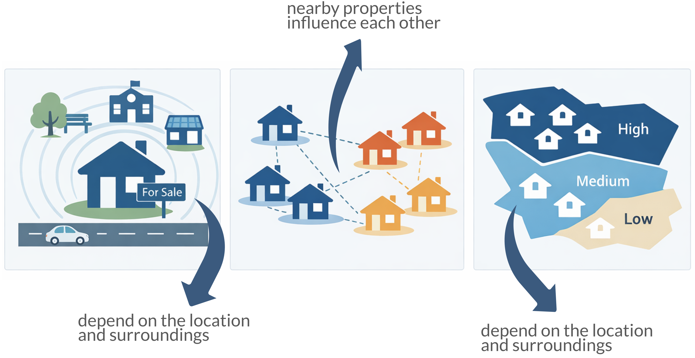
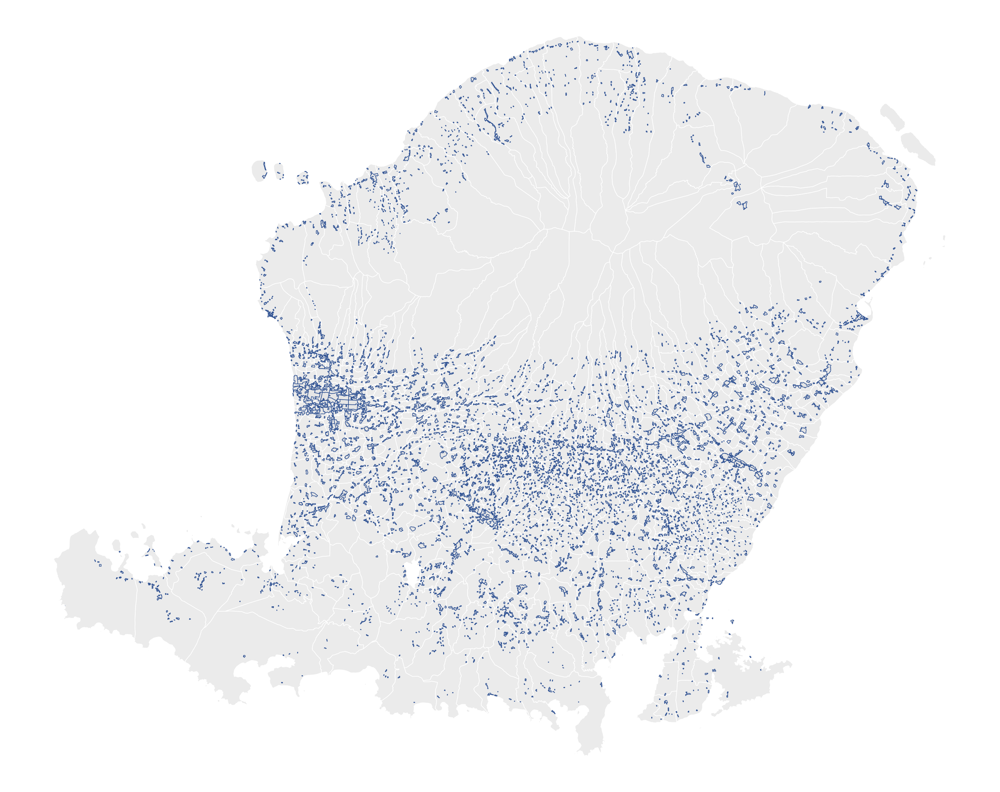
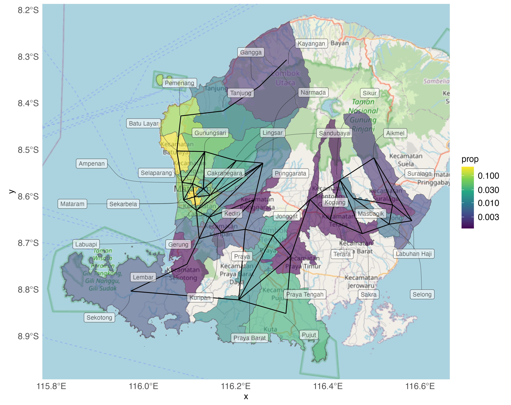
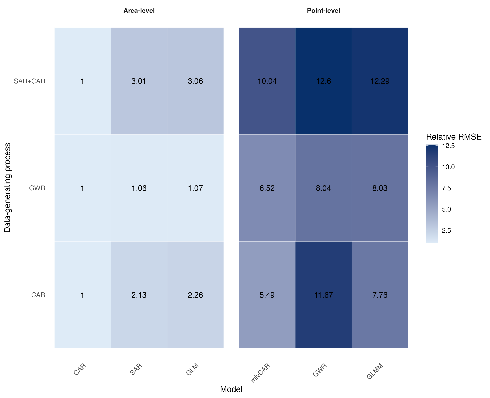

## Background

::: {.incremental}

- Spatial data violate independence assumptions
- Hierarchical structure is common in practice
- Ignoring these leads to bias and inefficiency
- Multiple spatial models exist
- **However: no clear guidance on which model to use**

:::

## Example

{fig-align="center"}

::: footer
@trojanek2018spatial; @helbich2017spatial; @heyman2019house; @brunauer2013modelling; @jamil2025spatio
:::

## Just a bit contextual...

::: columns
::: {.column width="50%"}
::: {style="text-align: center;"}

:::
:::

::: {.column width="50%"}
::: {style="text-align: center;"}

:::
:::
:::

::: footer
Credit: OpenStreetMap contributors
:::

## The Models

-   **Standard regression models** $\sum_{k=1}^p \beta_k x_{ik}$ ignore spatial dependence in housing prices;

-   **Geographically weighted regression (GWR)**: $\sum_{k=1}^p \beta_k(s)x_k(s)$; requires precise location information;

-   **Simultaneously Autoregressive models (SAR)**: $\rho \sum_{s'} w(s,s') y(s') + \sum_{k=1}^p \beta_k x_k(s)$ not naturally designed for hierarchical data with multiple observations per spatial unit;

-   **Conditionally autoregressive models (CAR)** remain underused in the study areas that require a spatial regression model

::: footer
**Notes: the equations are not complete. This is aimed to show the core component of each model**

@yu2011gtwr; @yan2019evaluating;@helbich2013spatiotemporal; @wall2004close; @trojanek2018spatial
:::

## Conditional Autoregressive (CAR) Model

::: {.fragment .fade-up}

$$
y(s) = \sum_{k=1}^p \beta_k x_k(s) + \phi(s) + \varepsilon(s)
$${#eq-car}

- it **models spatial dependence through a latent, area-level effect**;
- providing a natural framework for areal and hierarchical data
:::

## Spatial structure via CAR: the role of $\boldsymbol{\phi}$

- Leroux prior:

::: {.fragment .fade-up}

$$
\phi_i|\boldsymbol{\phi}_{-i}, \mathbf{W},\rho, \sigma_{\phi}^2  \sim  N\left(\frac{\rho\sum_{m=1}^Mw_{mi}\phi_m}{A},\frac{\sigma_{\phi}^2}{A}\right)
$$ {#eq-lerouxphi}

:::

- where:

  * $A = \rho\sum_{m=1}^Mw_{im}+1-\rho$
  * $\rho \sim \mathcal{Unif}(0,1)$
  * $\tau^2 \ \sim \Gamma^{-1}(a,b)$

## Neighbourhood matrix $\mathbf{W}$

::: columns
::: {.column width="50%"}
:::{.fragment}

* $\mathbf{W}$ is a neighbourhood matrix
:::

:::{.fragment}

{width="100%"}

:::

:::

:::{.column width="50%"}

:::{.fragment}

$$
  \mathbf{W} =
  \begin{array}{cccccc}
   & A & B & C & D & E \\
A & 0 & 1 & 1 & 1 & 1\\ 
B & 1 & 0 & 1 & 0 & 0\\ 
C & 1 & 1 & 0 & 1 & 0\\
D & 1 & 0 & 1 & 0 & 1\\
E & 1 & 0 & 0 & 1 & 0\\
\end{array}
$$

:::

:::
:::

## Areal Data Structure: Single vs Multiple Observations

:::{.fragment}
- Standard CAR assumes one value per area; real data often contain multiple observations per area;
:::

:::{.fragment}
::: columns
::: {.column width="50%"}

:::

:::{.column width="50%"}

:::
:::
:::

## Multilevel CAR Model {.scrollable transition="slide"}

::: {.fragment .fade-in}

- When handling $j$ observations within each area $i$, @eq-mlvcar closely resembles GWR, with the exception of the $\phi$ component.
- Let $y_j(s)$ represent property price observed at the $s-$th area. Then
:::

::: {.fragment .fade-in}

$$
\begin{aligned}
y_j(s) &= \sum_{k=1}^p \beta_k x_{kj}(s) + \varepsilon_j(s) + \phi(s)\\
\end{aligned}
$$ {#eq-mlvcar}

- where $\boldsymbol{\varepsilon}_k \sim \mathcal{N}(0, \nu^2)$

:::

## The Models Differences

## The Simulation Framework{#sims1_main}

::: {style="text-align: center;"}
{width="100%"}
:::

<!-- ::: callout-note -->
<!-- - Generate spatial data under different data-generating processes (CAR, SAR+CAR, GWR) -->
<!-- - Fit competing models at point-level and area-level -->
<!-- - Evaluate performance using RMSE and parameter estimates -->
<!-- ::: -->

::: footer
More details $\rightarrow$ [Simulation 1 Diagram](#sims1)
:::

<!-- ### What are they? -->

<!-- -   This study consists of two simulation experiments. -->

<!-- -   Simulation 1 evaluates the performance of CAR and multilevel CAR (mlvCAR) models in comparison with alternative spatial regression models under controlled artificial spatial settings. -->

<!-- -   Simulation 2 investigates how a spatial factor-based model can be used to handle missing values in covariates, while preserving spatial dependence. -->

# Key Results

## Systematic Bias Across Spatial Structures

::: columns
::: {.column width="50%"}
::: {style="text-align: center;"}
{width="100%"}
:::
:::

::: {.column width="50%"}
::: {style="text-align: center;"}
{width="100%"}
:::
:::

:::

::: callout-note

## What can be seen?

  - Model performance depends on alignment with the true spatial process (DGP);
  - CAR provides stable estimates under spatial dependence;
  - Multilevel CAR further reduces bias for hierarchical data
  
:::

## Prediction Accuracy Follows Model–Data Alignment

{fig-align="center" width="60%"}

## Key Takeaway

Beyond standard simulation studies, this work introduces:

- Multiple spatial data-generating mechanisms
- Simultaneous evaluation under CAR, GWR, and hybrid SAR+CAR processes
- Systematic misspecification analysis
- Integration of hierarchical spatial modelling

**Code & Reproducibility**

https://github.com/indiraputeri-phd/CAR_simcomp

# Thank you :)

# Appendix

## Appendix A: Simulation diagram {#sims1 .scrollable}

::: {style="text-align: center;"}
{width="80%"}
:::

[← Back](#sims1_main)

## References
